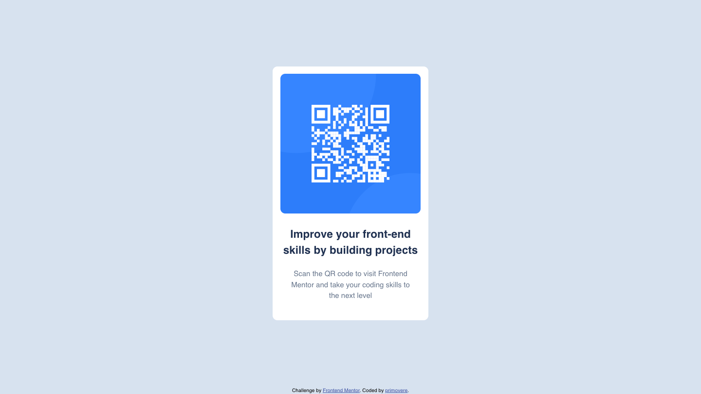

# Frontend Mentor - QR code component solution

This is a solution to the [QR code component challenge on Frontend Mentor](https://www.frontendmentor.io/challenges/qr-code-component-iux_sIO_H).

## Table of contents

- [Overview](#overview)
  - [Screenshot](#screenshot)
  - [Links](#links)
- [My process](#my-process)
  - [Built with](#built-with)
  - [What I learned](#what-i-learned)

## Overview

### Screenshot

<p align="center">
  
  
</p>

### Links

- Solution URL: [Add solution URL here](https://your-solution-url.com)
- Live Site URL: [Add live site URL here](https://your-live-site-url.com)

## My process

### Built with

- Semantic HTML5 markup
- CSS custom properties
- Flexbox
- Mobile-first workflow

### What I learned

- It's my first time to create a projects with starter files.
  I learned how to push existing files to a GitHub repo.
  1. Go to the project folder

`cd Downloads/qr-code-component-main`

2.  Start to track the folder's version change

`git init`

3. Add all files to the stage for the following commit (version record)

   `git add .`

4. Commit the added files in the last step as the first version, like a snapshot, with a message.

   `git commit -m "first commit"`

5. Rename the current branch to main to ensure the local branch and GitHub's have the same name

   `git branch -M main`

6. Set the folder connect to the specified GitHub URL

   `git remote add origin git@github.com:username/qr-code-component.git`

7. Push the change you just made to GitHub

   `git push -u origin main`

- Estimate sizes of elements using transparency div in browser, Preview, and screenshot tool.

- How to shift the starting point of each line in the paragraph

```css
.instruction {
  padding: 0 20px;
}
```

- push footer to bottom using flex: 1 on `<main>`
